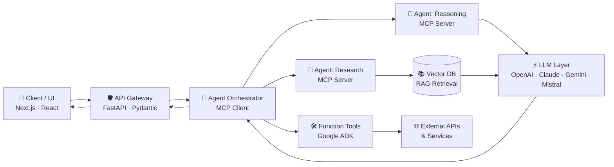

<!-- ══════════════════════════════ HERO ══════════════════════════════ -->
<div align="center">


<br/>


<br/><br/>

<a href="https://www.linkedin.com/in/kelavathbalajinaik/"></a>&nbsp;
<a href="https://kelavathbalajinaik91221.vercel.app/"></a>&nbsp;
<a href="https://leetcode.com/u/kelavathbalajinaik/"></a>&nbsp;
<a href="mailto:kelavathbalaji@gmail.com"></a>&nbsp;


</div>

<br/>

<!-- ══════════════════════════════ POSITIONING ══════════════════════════════ -->

## ⚡ Who I Am


> **I engineer intelligent systems end-to-end** — from designing multi-agent architectures and fine-tuning LLMs, to shipping the typed APIs, data layers, and frontends that put them in production.

- 🤖 **Agentic AI on MCP** — custom clients, servers & multi-agent orchestration
- 📚 **RAG + fine-tuning** across OpenAI, Claude, Gemini & Mistral
- ⚙️ **Typed production backends** — FastAPI, Pydantic, Postgres, Redis
- 🌐 **Full stack delivery** — React / Next.js / TypeScript
- 🌱 Currently: **Google ADK** + function-tool development

<br clear="right"/>

```python
class BalajiNaik(Engineer):
    def __init__(self):
        self.roles       = ["Applied AI Engineer", "ML Engineer", "Full Stack Engineer", "Backend Engineer"]
        self.ai_stack    = ["Agentic AI (MCP)", "RAG Pipelines", "LLM Fine-Tuning", "Multi-Agent Orchestration"]
        self.llm_apis    = ["OpenAI", "Claude", "Gemini", "Mistral", "OpenRouter"]
        self.ml_depth    = ["Supervised", "Unsupervised", "Reinforcement Learning", "NLP", "Computer Vision"]
        self.backend     = ["FastAPI", "Pydantic", "Node.js", "PostgreSQL", "MongoDB", "Redis"]
        self.frontend    = ["React", "Next.js", "TypeScript", "Tailwind"]
        self.now         = "Google ADK integration + Function-tool / agent-as-a-tool development"

    def philosophy(self) -> str:
        return "Models are easy. Systems are hard. I build the systems."
```

---

<!-- ══════════════════════════════ WHAT I BUILD ══════════════════════════════ -->

## 🧠 What I Build

<table>
<tr>
<td width="33%" align="center" valign="top">

### 🤖 Agentic AI Systems


Multi-agent architectures on **Model Context Protocol** — custom MCP clients & servers, agent-to-agent collaboration, function tools, and agent-as-a-tool patterns. Currently extending with **Google ADK**.

</td>
<td width="33%" align="center" valign="top">

### 📚 LLM & RAG Engineering


Production **RAG pipelines** with vector databases, hybrid retrieval, and grounded generation. **Fine-tuning workflows** for domain-specific models across OpenAI, Claude, Gemini & Mistral.

</td>
<td width="33%" align="center" valign="top">

### ⚙️ Production Backends


Typed, scalable APIs with **FastAPI + Pydantic**, async processing, caching with **Redis**, and data modeling across **PostgreSQL / MongoDB**. Containerized with **Docker**, deployed on **AWS**.

</td>
</tr>
<tr>
<td width="33%" align="center" valign="top">

### 🔬 Machine Learning


Full ML lifecycle — supervised, unsupervised & **reinforcement learning** with PyTorch / TensorFlow, from feature engineering to training, evaluation, and deployment.

</td>
<td width="33%" align="center" valign="top">

### 🌐 Full Stack Products


Complete products with **React / Next.js / TypeScript** frontends over Node & Python backends — auth, dashboards, real-time features, and clean UX.

</td>
<td width="33%" align="center" valign="top">

### 🧩 Algorithms & DSA


Consistent problem solving on **LeetCode** — data structures, algorithmic thinking, and complexity-aware engineering carried into every system I design.

</td>
</tr>
</table>

---

<!-- ══════════════════════════════ AI SYSTEM BLUEPRINT ══════════════════════════════ -->

## 🏗️ How My AI Systems Are Wired



<div align="center"><i>Gateway → Orchestrator → Specialized agents → Retrieval-grounded LLMs. Typed at every boundary.</i></div>

---

<!-- ══════════════════════════════ TECH ARSENAL ══════════════════════════════ -->

## 🛠️ Tech Arsenal

<div align="center">

### AI / LLM Layer


### ML & Data Science


### Backend Engineering


### Frontend & Product


### Infra & DevOps


</div>

---

<!-- ══════════════════════════════ FLAGSHIP WORK ══════════════════════════════ -->

## 🚀 Flagship Work

<table>
<tr>
<td width="50%" valign="top">

### 🤖 Multi-Agent RAG System
**Specialized agents over a shared retrieval layer.** Orchestrator routes queries to research/reasoning agents; hybrid retrieval grounds every generation; MCP handles agent-to-agent context passing.

  

</td>
<td width="50%" valign="top">

### 🔧 LLM Fine-Tuning Pipeline
**Dataset → training → evaluation, automated.** End-to-end pipeline for adapting foundation models to domain-specific tasks, with reproducible configs and evaluation gates before release.

  

</td>
</tr>
<tr>
<td width="50%" valign="top">

### 🛡️ AI-Powered API Gateway
**One typed interface, many LLM providers.** FastAPI gateway unifying OpenAI, Claude, Gemini & Mistral behind consistent schemas — with routing, fallback, and validation via Pydantic.

  

</td>
<td width="50%" valign="top">

### 📄 Intelligent Document Processing
**Documents in, structured intelligence out.** Claude- and Gemini-powered extraction, classification, and analysis over unstructured documents.

  

</td>
</tr>
<tr>
<td width="50%" valign="top">

### 🐍 [Snake AI — Deep RL Agent](https://github.com/Balaji91221/snake-ai-pytorch)
**Reinforcement learning from scratch.** Reward-driven agent that learns Snake through deep Q-learning in an interactive PyTorch + Pygame environment.

 

</td>
<td width="50%" valign="top">

### 🍔 [Food Delivery Platform](https://github.com/Balaji91221/Food-delivery-App) · [Live ↗](https://food-delivery-app-coral-six.vercel.app/)
**Full-stack, end to end.** Ordering platform with auth, cart & category flows, and a complete admin dashboard for catalog management.

  

</td>
</tr>
</table>

<div align="center">

🗂️ [Explore all repositories →](https://github.com/Balaji91221?tab=repositories)

</div>

---

<!-- ══════════════════════════════ METRICS ══════════════════════════════ -->

<!-- ══════════════════════════════ FOR RECRUITERS ══════════════════════════════ -->

## 💼 Why Work With Me

| 🎯 | What you get |
|---|---|
| **End-to-end ownership** | I take features from architecture diagram → model → API → UI → deploy. No hand-offs needed. |
| **AI that ships** | Not notebook demos — production RAG, agent systems, and fine-tuned models behind typed, tested APIs. |
| **Engineering discipline** | Pydantic-validated boundaries, Dockerized services, DSA-grounded problem solving (active on LeetCode). |
| **Current stack, not last year's** | Already building on MCP and Google ADK — the newest agent tooling in production patterns. |

<div align="center">
  
</div>

## 📊 Engineering Metrics

<div align="center">


<br/><br/>


<br/><br/>


<!--
🐍 CONTRIBUTION SNAKE — uncomment this block AFTER setting up .github/workflows/snake.yml
and running the "Generate Contribution Snake" action once from the Actions tab.

<br/><br/>

<picture>
  <source media="(prefers-color-scheme: dark)" srcset="https://raw.githubusercontent.com/Balaji91221/Balaji91221/output/github-contribution-grid-snake-dark.svg"/>
  <source media="(prefers-color-scheme: light)" srcset="https://raw.githubusercontent.com/Balaji91221/Balaji91221/output/github-contribution-grid-snake.svg"/>
  
</picture>
-->

</div>

---

<!-- ══════════════════════════════ CONNECT ══════════════════════════════ -->

## 🤝 Let's Build Something Intelligent

<div align="center">

**Open to roles and collaborations in Applied AI, ML Engineering, Backend & Full Stack — especially anything involving agents.**

<br/>

<a href="https://www.linkedin.com/in/kelavathbalajinaik/"></a>&nbsp;
<a href="mailto:kelavathbalaji@gmail.com"></a>&nbsp;
<a href="https://kelavathbalajinaik91221.vercel.app/"></a>

<br/><br/>


</div>
